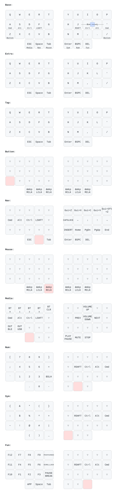

# ZMK Config for Crosses/Bridges

  &nbsp;&nbsp;&nbsp;&nbsp; 

This repository provides the official ZMK firmware for the "MIAOMIAO" hardware variant of the Crosses/Bridges split keyboard. It features native ZMK Studio support for real-time remapping and optimized wireless performance.

### This branch is for the 3x5 layout single-trackball variant.
- For the wireless 3x5 layout dual-trackball version, use this library: [zmk-for-crosses35-dual](https://github.com/HeeTuic/zmk-for-crosses35-dual)  
- For the wireless 3x6 layout dual-trackball version, use this library: [zmk-for-crosses36-dual](https://github.com/HeeTuic/zmk-for-crosses36-dual)  
- For the wireless 4x6 layout dual-trackball version, use this library: [zmk-for-crosses46-dual](https://github.com/HeeTuic/zmk-for-crosses46-dual)  

---

## 🗺️ Keymap Layout

*This layout diagram is automatically generated and updated via GitHub Actions whenever changes are committed to the `.keymap` file.*

---

## Trackball Behavior

This branch uses ZMK input processors for the right-half PMW3610 trackball:

- Normal pointer speed is `1600 CPI / 4`, matching the original configuration.
- The PMW driver's direct `automouse-layer` activation is disabled.
- A deadzone processor filters micro-vibrations before they become pointer movement.
- ZMK's temporary layer processor activates the `BUTTON` layer for mouse clicks after real trackball movement.
- The `BUTTON` layer will not activate until the keyboard has been idle for `250 ms`, which prevents normal typing from turning thumb keys into mouse buttons.

Current tuning lives in `config/boards/shields/crosses/crosses_right.overlay`:

- Deadzone threshold: `10`
- Deadzone reset timeout: `150 ms`
- Mouse-button layer timeout: `400 ms`
- Prior keyboard idle required before mouse-button activation: `250 ms`

---

## 🛠️ Graphical Configuration

### 1. ZMK Studio (Simple Real-time Remapping)
Modify your keymap on the fly without re-flashing, leveraging the official ZMK Studio protocol. All changes take effect instantly.
- **How to Use**: Open and connect to [ZMK Studio](https://zmk.studio/) using a compatible Chromium-based browser (e.g., Chrome or Edge), or use the standalone desktop client.
- **Core Advantage**: **Instant Communication**. Interacts directly with the hardware via USB (WebHID) or Web Bluetooth. This eliminates the need to wait for GitHub Actions to compile or to manually flash firmware, making it perfect for quick, daily adjustments to basic key assignments.

### 2. Keymap Editor (Online Full Compilation)
The most mature visual web editor in the community, deeply integrated with your GitHub workflow. It is ideal for comprehensive overhauls of your keyboard layout architecture.
- **How to Use**: [Fork](https://docs.github.com/en/get-started/quickstart/fork-a-repo#forking-a-repository) this repository and run the initial firmware compilation under the [GitHub Actions](https://docs.github.com/en/actions/managing-workflow-runs-and-deployments/managing-workflow-runs/disabling-and-enabling-a-workflow#enabling-a-workflow) tab. Then, log into [Keymap Editor](https://nickcoutsos.github.io/keymap-editor/), authorize access, and select your `zmk-for-crosses` repository.
- **Core Advantage**: **All-inclusive Editing**. Drag and drop to modify keymaps in an intuitive graphical interface with full support for Combos, Macros, and advanced ZMK Behaviors. Saving your changes automatically commits the code to GitHub and triggers a cloud build.

---

## 🚀 Firmware Flashing Guide

> **📌 Flashing Notice:**
> - **Flashing Required**: You only need to perform the flashing process below when modifying layouts via **Keymap Editor**, directly editing the **repository source code**, or performing the **initial setup** on a new keyboard.
> - **No Flashing Required**: If you are using **ZMK Studio** for real-time keymap adjustments, changes are saved directly to the hardware's onboard flash memory. You can bypass this guide completely.

### Standard Flashing Workflow:

1. **Firmware Compilation**: Saving changes in Keymap Editor or pushing code commits will automatically trigger a GitHub Actions build. Navigate to the **Actions** tab of your repository to check the latest build status.
2. **Download Firmware**: Once the build finishes successfully, scroll down to the **Artifacts** section at the bottom of the build page and download `firmware.zip`.
3. **Extract Files**: Unzip the archive to retrieve the `left.uf2` and `right.uf2` firmware files for the respective halves of the keyboard.
4. **Trigger Bootloader**: Connect one half of the keyboard to your PC via a USB cable. Double-tap the hardware Reset button on the controller to enter bootloader mode (the device will mount to your computer as a virtual mass storage drive).
5. **Flash the Drive**: Drag and drop the corresponding `.uf2` file into the virtual drive. The microcontroller will automatically flash the firmware, reboot, and unmount itself.

> **⚠️ Note:** The microcontrollers for the left and right halves operate independently. You must connect and flash each half individually via USB.

---

## 📝 Acknowledge & Support

*   **Documentation Note**: This documentation was drafted with AI assistance and thoroughly reviewed/refined by the author to guarantee technical accuracy. We apologize for any minor linguistic nuances or awkward phrasing resulting from automation.
*   **Technical Support**: If you are using a Crosses/Bridges split keyboard and encounter any issues regarding firmware usage, graphical configuration, or flashing, please feel free to reach out to the author through these channels:
    *   **📩 Gmail**: `heetuic@gmail.com`
    *   **🐟 Xianyu (闲鱼)**: Search for user **"喵喵喵猫"**

---
